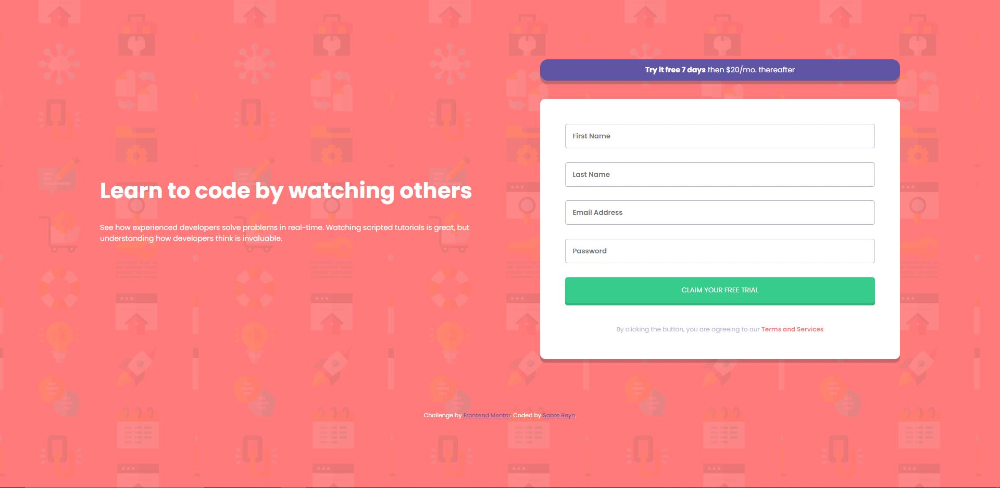

# Frontend Mentor - Intro component with sign up form


## Table of contents

- [Overview](#overview)
  - [The challenge](#the-challenge)
  - [Screenshot](#screenshot)
  - [Links](#links)
- [My process](#my-process)
  - [Built with](#built-with)
  - [What I learned](#what-i-learned)
  - [Useful resources](#useful-resources)
- [Author](#author)
- [Acknowledgments](#acknowledgments)

## Overview

## The challenge

Users should be able to:

- View the optimal layout for the site depending on their device's screen size
- See hover states for all interactive elements on the page
- Receive an error message when the `form` is submitted if:
  - Any `input` field is empty. The message for this error should say _"[Field Name] cannot be empty"_
  - The email address is not formatted correctly (i.e. a correct email address should have this structure: `name@host.tld`). The message for this error should say _"Looks like this is not an email"_

### Screenshot



### Links

- Solution URL: [Code](https://github.com/sabrereyn/signup-form-frontendmentor)
- Live Site URL: [Live](https://sabrereyn.github.io/signup-form-frontendmentor/)

## My process

### Built with

- Semantic HTML5 markup
- CSS custom properties
- CSS Grid
- Mobile-first workflow

### What I learned

```css
.error-email::placeholder {
  color: hsl(0, 100%, 74%);
  font-weight: 600;
}
```

This snippet of code in my css targets the placeholder of the class. This was applied to my email's input text. This basically just opened my eyes to the fact that the ::placeholder code didn't necessarily have to be connected directly to the input element. So many things you can do with css alone!

### Useful resources

- [MDN Website](https://developer.mozilla.org/en-US/) - I cannot stress enough how much MDN helped with... everything.

## Author

- Frontend Mentor - [@sabrereyn](https://www.frontendmentor.io/profile/sabrereyn)
- Twitter - [@Sabre_Reyn](https://www.twitter.com/Sabre_Reyn)
